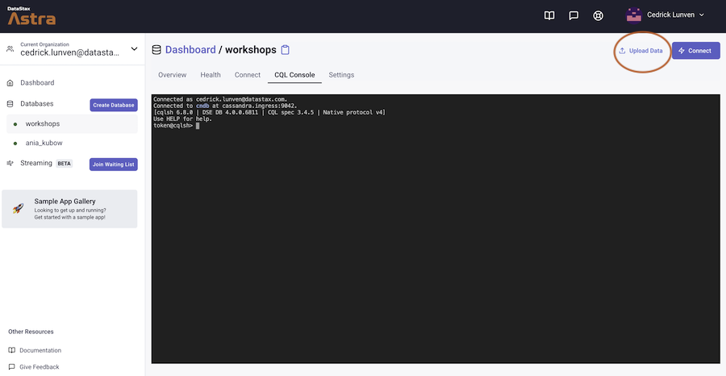
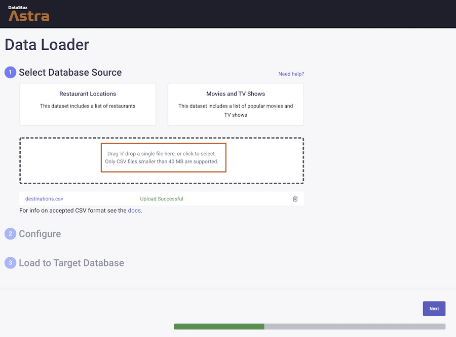
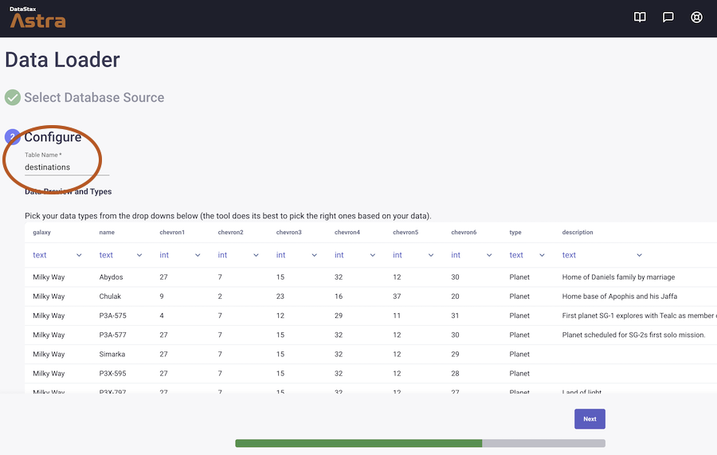
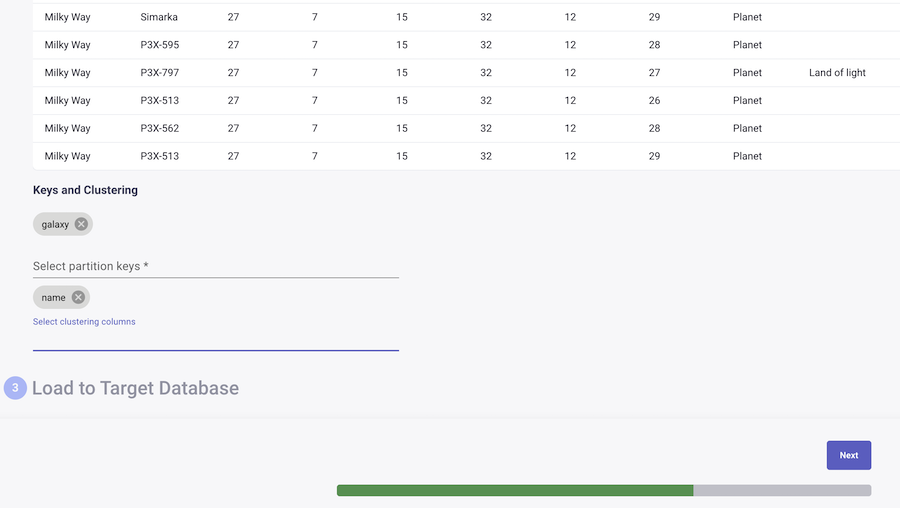
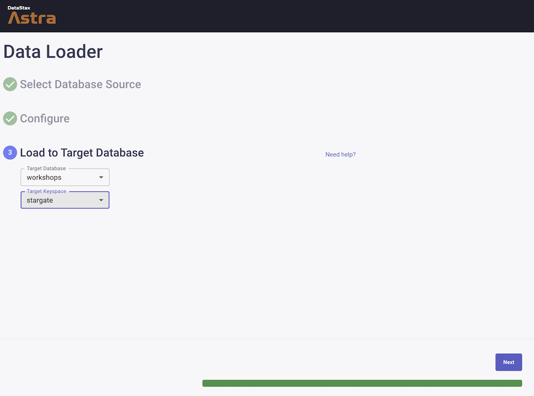
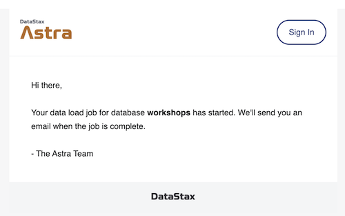
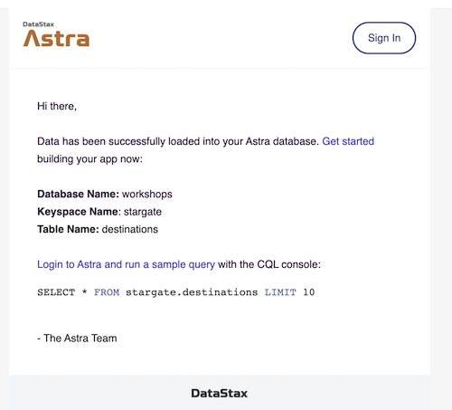

#  Workshop Spring Data Cassandra and Stargate

[](https://gitpod.io/#https://github.com/DataStax-Academy/workshop-spring-data-cassandra) 
[](http://www.apache.org/licenses/LICENSE-2.0)
[](https://discord.com/widget?id=685554030159593522&theme=dark)

Today we show you and application using  **Apache Cassandra™** as a backend implemented with **Spring Boot**, **Spring Data**, the **[Stargate](http://stargate.io)** and relating SDK.


Which better business domain than the TV Show **Stargate** hoping it will not bring any confusion ^^.


ℹ️ **Frequently asked questions**

- *Can I run the workshop on my computer?*
> There is nothing preventing you from running the workshop on your own machine. If you do so, you will need *java jdk11+*, *Maven*, an IDE like *VSCode, IntelliJ, Eclipse,Spring STS*. You will have to adapt commands and paths based on your environment and install the dependencies by yourself. **We won't provide support** to keep on track with schedule.

## Table of content

1. [Create Astra Instance](#1-create-astra-instance)
2. [Create Tables and insert data](#2-create-table-and-load-data)
3. [Load dataSet as a CSV](#)
4. [Create Astra Token](#3-create-astra-token)
5. [Launch Gitpod](#)
6. [Know your Gitpod](#)
7. [Setup your Application](#)
8. [Run Unit tests](#)
9. [Run the Application](#)
10. [Using Stargate Rest API](#)
11. [Using Stargate Document API](#)
11. [Using Stargate GraphQL API](#)
12. [Walkthrough Stargate SDK](#)


## 1. Create Astra Instance

**`ASTRA`** is the simplest way to run Cassandra with zero operations at all - just push the button and get your cluster. No credit card required, $25.00 USD credit every month, roughly 5M writes, 30M reads, 40GB storage monthly - sufficient to run small production workloads.  

✅ **Step 1a. If you do have an account yet register and sign In to Astra this is FREE and NO CREDIT CARD asked** [https://astra.datastax.com](https://dtsx.io/workshop): You can use your `Github`, `Google` accounts or register with an `email`.

_Make sure to chose a password with minimum 8 characters, containing upper and lowercase letters, at least one number and special character_

✅ **Step 1b. Create a "pay as you go" plan**

Follow this [guide](https://docs.datastax.com/en/astra/docs/creating-your-astra-database.html), to set up a pay as you go database with a free $25 monthly credit. You will find below recommended values to enter: 

- **For the database name** - `workshops`

- **For the keyspace name** - `stargate`

_You can technically use whatever you want and update the code to reflect the keyspace. This is really to get you on a happy path for the first run._

- **For provider and region**: Choose and provider (Gcp, Azure or AWS) and then the related region is where your database will reside physically (choose one close to you or your users).

- **Create the database**. Review all the fields to make sure they are as shown, and click the `Create Database` button.

You will see your new database `pending` in the Dashboard.


The status will change to `Active` when the database is ready, this will only take 2-3 minutes. You will also receive an email when it is ready.

**👁️ Walkthough**


## 2. Create Table and load data

Once the database is created we want to create the tables to insert Data.

✅ **Step2a: Locate and open CQLConsole**

- Click the name of you database `workshops` in the panel on the left

- Locate the tab `CQL Console`, the prompt will open, there is no need to enter credentials here.


✅ **Step 2b: Navigate to your keyspace**

- Enter the following statement in CqlSH console to list existing keyspaces, you should see the one you created with the database.

```sql
describe keyspaces;
```

- Enter the following statement in CqlSH console to select your keyspace:

```sql
use stargate;
```

✅ **Step 2c: Create Entities**

- Enter the following statement in CqlSH console to Create a table `chevrons` with the following

```sql
CREATE TABLE IF NOT EXISTS stargate.chevrons(
   area text,
   code int ,
   name text,
   picture text,
   PRIMARY KEY ((area), code)
) WITH CLUSTERING ORDER BY (code ASC);
```

✅ **Step 2d: Populate entries**

- Enter the following statement in CqlSH console to enter the different chevrons in the database

```sql
INSERT INTO chevrons (area, code, name, picture) VALUES ('Milky Way', 1, 'Earth', 'https://github.com/datastaxdevs/workshop-spring-stargate/blob/main/images/glyphs/001glyph-earth.jpg?raw=true');
INSERT INTO chevrons (area, code, name, picture) VALUES ('Milky Way', 2, 'Crater', 'https://github.com/datastaxdevs/workshop-spring-stargate/blob/main/images/glyphs/002glyph-crater.jpg?raw=true');
INSERT INTO chevrons (area, code, name, picture) VALUES ('Milky Way', 3, 'Virgo', 'https://github.com/datastaxdevs/workshop-spring-stargate/blob/main/images/glyphs/003glyph-virgo.jpg?raw=true');
INSERT INTO chevrons (area, code, name, picture) VALUES ('Milky Way', 4, 'Bootes', 'https://github.com/datastaxdevs/workshop-spring-stargate/blob/main/images/glyphs/004glyph-bootes.jpg?raw=true');
INSERT INTO chevrons (area, code, name, picture) VALUES ('Milky Way', 5, 'Centaurus', 'https://github.com/datastaxdevs/workshop-spring-stargate/blob/main/images/glyphs/005glyph-centarus.jpg?raw=true');
INSERT INTO chevrons (area, code, name, picture) VALUES ('Milky Way', 6, 'Libra', 'https://github.com/datastaxdevs/workshop-spring-stargate/blob/main/images/glyphs/006glyph-libra.jpg?raw=true');
INSERT INTO chevrons (area, code, name, picture) VALUES ('Milky Way', 7, 'Serpenscaput', 'https://github.com/datastaxdevs/workshop-spring-stargate/blob/main/images/glyphs/007glyph-serpenscaput.jpg?raw=true');
INSERT INTO chevrons (area, code, name, picture) VALUES ('Milky Way', 8, 'Norma', 'https://github.com/datastaxdevs/workshop-spring-stargate/blob/main/images/glyphs/008glyph-norma.jpg?raw=true');
INSERT INTO chevrons (area, code, name, picture) VALUES ('Milky Way', 9, 'Scorpio', 'https://github.com/datastaxdevs/workshop-spring-stargate/blob/main/images/glyphs/009glyph-scorpio.jpg?raw=true');
INSERT INTO chevrons (area, code, name, picture) VALUES ('Milky Way', 10, 'Cra', 'https://github.com/datastaxdevs/workshop-spring-stargate/blob/main/images/glyphs/010glyph-cra.jpg?raw=true');
INSERT INTO chevrons (area, code, name, picture) VALUES ('Milky Way', 11, 'Scutum', 'https://github.com/datastaxdevs/workshop-spring-stargate/blob/main/images/glyphs/011glyph-scutum.jpg?raw=true');
INSERT INTO chevrons (area, code, name, picture) VALUES ('Milky Way', 12, 'Sagitarus', 'https://github.com/datastaxdevs/workshop-spring-stargate/blob/main/images/glyphs/012glyph-sagittarius.jpg?raw=true');
INSERT INTO chevrons (area, code, name, picture) VALUES ('Milky Way', 13, 'Aquila', 'https://github.com/datastaxdevs/workshop-spring-stargate/blob/main/images/glyphs/013glyph-aquila.jpg?raw=true');
INSERT INTO chevrons (area, code, name, picture) VALUES ('Milky Way', 14, 'Mic', 'https://github.com/datastaxdevs/workshop-spring-stargate/blob/main/images/glyphs/014glyph-mic.jpg?raw=true');
INSERT INTO chevrons (area, code, name, picture) VALUES ('Milky Way', 15, 'Capricorn', 'https://github.com/datastaxdevs/workshop-spring-stargate/blob/main/images/glyphs/015glyph-capricorn.jpg?raw=true');
INSERT INTO chevrons (area, code, name, picture) VALUES ('Milky Way', 16, 'Piscesaustrinus', 'https://github.com/datastaxdevs/workshop-spring-stargate/blob/main/images/glyphs/016glyph-piscesaustrinus.jpg?raw=true');
INSERT INTO chevrons (area, code, name, picture) VALUES ('Milky Way', 17, 'Equuleus', 'https://github.com/datastaxdevs/workshop-spring-stargate/blob/main/images/glyphs/017glyph-equuleus.jpg?raw=true');
INSERT INTO chevrons (area, code, name, picture) VALUES ('Milky Way', 18, 'Aquarius', 'https://github.com/datastaxdevs/workshop-spring-stargate/blob/main/images/glyphs/018glyph-aquarius.jpg?raw=true');
INSERT INTO chevrons (area, code, name, picture) VALUES ('Milky Way', 19, 'Pegasus', 'https://github.com/datastaxdevs/workshop-spring-stargate/blob/main/images/glyphs/019glyph-pegasus.jpg?raw=true');
INSERT INTO chevrons (area, code, name, picture) VALUES ('Milky Way', 20, 'Sculptor', 'https://github.com/datastaxdevs/workshop-spring-stargate/blob/main/images/glyphs/020glyph-sculptor.jpg?raw=true');
INSERT INTO chevrons (area, code, name, picture) VALUES ('Milky Way', 21, 'Pisces', 'https://github.com/datastaxdevs/workshop-spring-stargate/blob/main/images/glyphs/021glyph-pisces.jpg?raw=true');
INSERT INTO chevrons (area, code, name, picture) VALUES ('Milky Way', 22, 'Andromeda', 'https://github.com/datastaxdevs/workshop-spring-stargate/blob/main/images/glyphs/022glyph-andromeda.jpg?raw=true');
INSERT INTO chevrons (area, code, name, picture) VALUES ('Milky Way', 23, 'Triangulum', 'https://github.com/datastaxdevs/workshop-spring-stargate/blob/main/images/glyphs/023glyph-triangulum.jpg?raw=true');
INSERT INTO chevrons (area, code, name, picture) VALUES ('Milky Way', 24, 'Aries', 'https://github.com/datastaxdevs/workshop-spring-stargate/blob/main/images/glyphs/024glyph-aries.jpg?raw=true');
INSERT INTO chevrons (area, code, name, picture) VALUES ('Milky Way', 25, 'Perseus', 'https://github.com/datastaxdevs/workshop-spring-stargate/blob/main/images/glyphs/025glyph-perseus.jpg?raw=true');
INSERT INTO chevrons (area, code, name, picture) VALUES ('Milky Way', 26, 'Cetus', 'https://github.com/datastaxdevs/workshop-spring-stargate/blob/main/images/glyphs/026glyph-cetus.jpg?raw=true');
INSERT INTO chevrons (area, code, name, picture) VALUES ('Milky Way', 27, 'Taurus', 'https://github.com/datastaxdevs/workshop-spring-stargate/blob/main/images/glyphs/027glyph-taurus.jpg?raw=true');
INSERT INTO chevrons (area, code, name, picture) VALUES ('Milky Way', 28, 'Auriga', 'https://github.com/datastaxdevs/workshop-spring-stargate/blob/main/images/glyphs/028glyph-auriga.jpg?raw=true');
INSERT INTO chevrons (area, code, name, picture) VALUES ('Milky Way', 29, 'Eridanus', 'https://github.com/datastaxdevs/workshop-spring-stargate/blob/main/images/glyphs/029glyph-eridanus.jpg?raw=true');
INSERT INTO chevrons (area, code, name, picture) VALUES ('Milky Way', 30, 'Orion', 'https://github.com/datastaxdevs/workshop-spring-stargate/blob/main/images/glyphs/030glyph-orion.jpg?raw=true');
INSERT INTO chevrons (area, code, name, picture) VALUES ('Milky Way', 31, 'Canisminor', 'https://github.com/datastaxdevs/workshop-spring-stargate/blob/main/images/glyphs/031glyph-canisminor.jpg?raw=true');
INSERT INTO chevrons (area, code, name, picture) VALUES ('Milky Way', 32, 'Monoceros', 'https://github.com/datastaxdevs/workshop-spring-stargate/blob/main/images/glyphs/032glyph-monoceros.jpg?raw=true');
INSERT INTO chevrons (area, code, name, picture) VALUES ('Milky Way', 33, 'Gemini', 'https://github.com/datastaxdevs/workshop-spring-stargate/blob/main/images/glyphs/033glyph-gemini.jpg?raw=true');
INSERT INTO chevrons (area, code, name, picture) VALUES ('Milky Way', 34, 'Hydra', 'https://github.com/datastaxdevs/workshop-spring-stargate/blob/main/images/glyphs/034glyph-hydra.jpg?raw=true');
INSERT INTO chevrons (area, code, name, picture) VALUES ('Milky Way', 35, 'Lynx', 'https://github.com/datastaxdevs/workshop-spring-stargate/blob/main/images/glyphs/035glyph-lynx.jpg?raw=true');
INSERT INTO chevrons (area, code, name, picture) VALUES ('Milky Way', 36, 'Cancer', 'https://github.com/datastaxdevs/workshop-spring-stargate/blob/main/images/glyphs/036glyph-cancer.jpg?raw=true');
INSERT INTO chevrons (area, code, name, picture) VALUES ('Milky Way', 37, 'Sextans', 'https://github.com/datastaxdevs/workshop-spring-stargate/blob/main/images/glyphs/037glyph-sextans.jpg?raw=true');
INSERT INTO chevrons (area, code, name, picture) VALUES ('Milky Way', 38, 'Leominor', 'https://github.com/datastaxdevs/workshop-spring-stargate/blob/main/images/glyphs/038glyph-leominor.jpg?raw=true');
INSERT INTO chevrons (area, code, name, picture) VALUES ('Milky Way', 39, 'Leo', 'https://github.com/datastaxdevs/workshop-spring-stargate/blob/main/images/glyphs/039glyph-leo.jpg?raw=true');
```

BTW those are real images, we should thank the [StargateWiki](http://stargate-sg1-solutions.com/wiki/Main_Page).


...

✅ **Step 2e: Show the results**

We have inserted 39 symbols of the `Milky Way` galaxy with `INSERT` statements but we could have use other solutions like [DSBulk](https://github.com/datastax/dsbulk), Spark, Apis or Astra Data Loader. We will show some of them to you later.

- Validate the number of chevrons 

```sql
select count(*) from stargate.chevrons;
```

- Show the chevrons known for the `Milky Way` galaxy

```sql
select code,name from stargate.chevrons where area='Milky Way';
```

## 3. Load dataSet as a CSV

Inserting a couple of values with CQLSH is great but quite verbose right ? we created the table and insert a couple of values.

In Astra there is a tool too speed up that process and both create and import data from a CSV.

✅ **Step 3a: Open Astra Data Loader**

Locate the `Upload Data` button to open the Data Loader.



✅ **Step 3b: Upload the CSV file**

Click the following button to download the DATASET.


Click on the area *Drag n drop... * and look for the file `destinations.csv` 










## 4. Create Astra Token

To interact with our new created database through code and programming we need to create some credentials.

✅ **Step 4a: Generate Token**

- Following the [Documentation](https://docs.datastax.com/en/astra/docs/manage-application-tokens.html) create a token with `Database Admnistrator` roles.

- Go the `Organization Settings`

- Go to `Token Management`

- Pick the role `Database Admnistrator` on the select box

**👁️ Walkthrough**


This is what the token page looks like. You can now download the values as a CSV. We will need those values but you can also keep this window open.


Notice the clipboard icon at the end of each value.

- `clientId:` We will use it as a username to contact Cassandra

- `clientSecret:` We will use it as a password to contact Cassandra

- `appToken:` We will use it as a api Key to interact with APIS.

## 4. Launch Gitpod

[Gitpod](https://www.gitpod.io/) is an IDE 100% online based on Eclipse Theia. To initialize your environment simply click on the button below *(CTRL + Click to open in new tab)* You will be asked for you github account.

[](https://gitpod.io/#https://github.com/datastaxdevs/workshop-spring-stargate)

**👁️ Expected output**

*The screenshot may be slightly different based on your default skin and a few edits in the read me.*


You can be asked to import the project, please accept to have java features enabled for you project.


**That's it.** Gitpod provides all tools we will need today including `Maven` and exporting port `8080`. At initialization of the workspace we schedule a `mvn clean install` to download dependencies.

Also you may have noticed there is a build happening - even before we get started. The sample project already exists and loading the developer enviroment triggers a build to download all the maven dependencies so you don't have to.

## 5. Know your gitpod

The workshop application has opened with an ephemeral URL. To know the URL where your application endpoint will be exposed you can run the following command in the terminal:

```bash
gp url 8080
```

**👁️ Expected output**


🚀 **Let's get starting**

To move to branch `PART1`, in a terminal use the following command. 

- You should read the instructions in gitpod now as moving to the next branch will update this README with the new instructions.

- When you move from one branch to another using checkout you will have the workspace populated with the solution. Your local changes will be lost.

## 6. Application Setup

Edit the configuraton file

## 7. CRUD with Spring Data

## 8. Start the Application

```
mvn spring-boot:run
```

## 9. Using Stargate API

## 10. Using SDK


